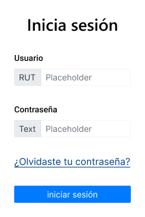

# Proyecto_Modulo_3_ABP_Felipe_Leiva

Dashboard para app de finanzas personales.

## Implementar una interfaz intuitiva y escalable de una aplicación bancaria

## de manera responsive, usando metodologia BEM (bloque, elemento y modificador) +y preprocesador Sass. Con estructura de carpetas 7-1 (Abstracts, base, components, layout, pages, themes y vendors).

```

text


scss/
│
├── base/ # Estilos globales
│ ├── _reset.scss
│ ├── _typography.scss
│ ├── _variables.scss
│ └── _base.scss
│
├── components/ # Componentes reutilizables
│ ├── _buttons.scss
│ ├── _cards.scss
│ └── _modals.scss
│
├── layout/ # Estructura de la página
│ ├── _header.scss
│ ├── _footer.scss
│ └── _grid.scss
│
├── pages/ # Estilos por página
│ ├── _home.scss
│ └── _contact.scss
│
├── themes/ # Temas y skins
│ ├── _light.scss
│ └── _dark.scss
│
├── utils/ # Mixins, funciones y helpers
│ ├── _mixins.scss
│ ├── _functions.scss
│ └── _helpers.scss
│
├── vendors/ # Librerías externas
│ └── _bootstrap.scss
│
└── main.scss # Archivo principal que importa todo

```

## Tecnologías y metodologías a utilizar:

- HTML5.
- CSS.
- BEM, OOCSS Ó SMACSS.
- Bootstrap 4 (Uso de componentes tales como: cards, menus, botones, etc.).
- Preprocesador SASS.
- Modelo de cajas y layout.
- Media Queries Flexbox o grid.
- Código limpio, modular y comentado.

## Etapas del proyecto a realizar:

Consta de 5 etapas las cuales se describen a continuación:

- Etapa 1: Del diseño a la implementación de un producto digital.
- Etapa 2: Metodologías elegida de organización y modularización de estilos.
- Etapa 3: Uso del preprocesador SASS.
- Etapa 4: El modelo de cajas y el layout.
- Etapa 5: Utilización de Bootstrap 4 como framework CSS.

## Entregables:

- Código fuente con los archivos y la estructura de carpetas utilizadas en el proyecto.
- Un docuemnto .md con la jsutificación metodologica.
- Versión navegable de la interfaz.
- Capturas de pantalla mostrando la interfaz en distintos dispositivos (Desktop, Telefonos moviles y tablets).
- Conclusiones personales. (Retrospectiva).

## Estructura del diseño del proyecto:

1.- Login de acceso.

Descripción:
Permitir el acceso al sistema a traves del ingreso de RUT y contraseña.
A continuación se muestran las imagenes que describen lo anterior.




Las credenciales de acceso son las siguientes:
RUT: 12345678-9
CONTRASEÑA: 123456

Ambos campos son obligatorios.

Si las credenciales de acceso son válidas, se accederá al home, inicio o menu principal de la aplicación.

2.- Recuperar contraseña.

En caso de olvidar la contraseña, al hacer click en el link ¿Olvidaste tu contraseña? mostrar una alerta que indique se se le enviará una contraseña de restauracion a su correo electrónico.

3.- Acceso al menu principal o home del sistema.

El home o menú principal tendrá en la sección superior, las siguientes pestañas de la interfaz gráfica:

- Billetera.
- Transferencias.
- Mis Cuentas.
- Pagos.

Al acceder al sistema, en la pestaña Billetera, se debe mostrar el saldo inicial. Para efectos del proyecto, lo definimos con un monto inicial de $50.000. Con este monto, se empiezan a realizar las diversas transacciones (Pagos).

El(la) usuario(a) tiene asociado por lo menos dos productos bancarios (ej: Tarjetas de debito y crédito) y entre cuentas se realizan las diversas transacciones (Pagos).

En la pestaña Mis cuentas, se visualiza los diversos productos bancarios que dispone el(la) usuario(a).

En la pestaña Pagos, se realizan las transacciones relacionadas con un pago en dinero a una cuenta del usuario(a). Es decir, añadir al saldo disponible un monto de dinero mayor a 0. Se debe mostrar una alerta o mensaje de error si el monto a pagar excede al saldo disponible. y mostrar un mensaje de éxito en caso de que el saldo disponible es mayor o igual al monto a pagar.
